# SmartCafeBuilder — Provider Web App User Manual

This manual explains how design studios and construction contractors use the SmartCafeBuilder web app, from creating an account to handing over a finished café.

Café owners use the SmartCafeBuilder **mobile app** to create projects, post briefs, approve work and pay. The web app described here is for **providers** — the people who do the work.

Screen labels are shown as they appear in the Vietnamese interface, followed by their English meaning in brackets, for example **“Đăng nhập”** (Log in).

## Contents

1. [Getting started](#1-getting-started)
2. [Account](#2-account)
3. [Your provider profile](#3-your-provider-profile)
4. [Finding work](#4-finding-work)
5. [Working on a project](#5-working-on-a-project)
6. [Design work](#6-design-work)
7. [Construction work](#7-construction-work)
8. [Notifications](#8-notifications)
9. [Subscription](#9-subscription)

---

## 1. Getting started

### 1.1 Roles

Every provider account has one capability, chosen when the profile is created. It decides which tools appear inside a project.

| Capability | Vietnamese label | Chapters that apply |
|---|---|---|
| Designer | “Thiết kế” / “Nhà thiết kế” | 1–6, 8, 9 |
| Contractor | “Thi công” / “Nhà thầu” | 1–5, 7, 8, 9 |
| Design & build | “Cả hai” / “Thiết kế & thi công” | All chapters |

Inside a project, the tools also follow the job itself: a design job shows the design tools, a construction job shows the construction tools, and a design-and-build job shows both.

### 1.2 Home page

The home page describes the service for providers. From the top bar you can open the marketplace, your projects, notifications, the language switch and the light/dark theme switch.

- Select **“Tìm việc”** (Find work) to browse the briefs owners have posted.
- Select **“Đăng ký làm đối tác”** (Join as a provider) to create an account.

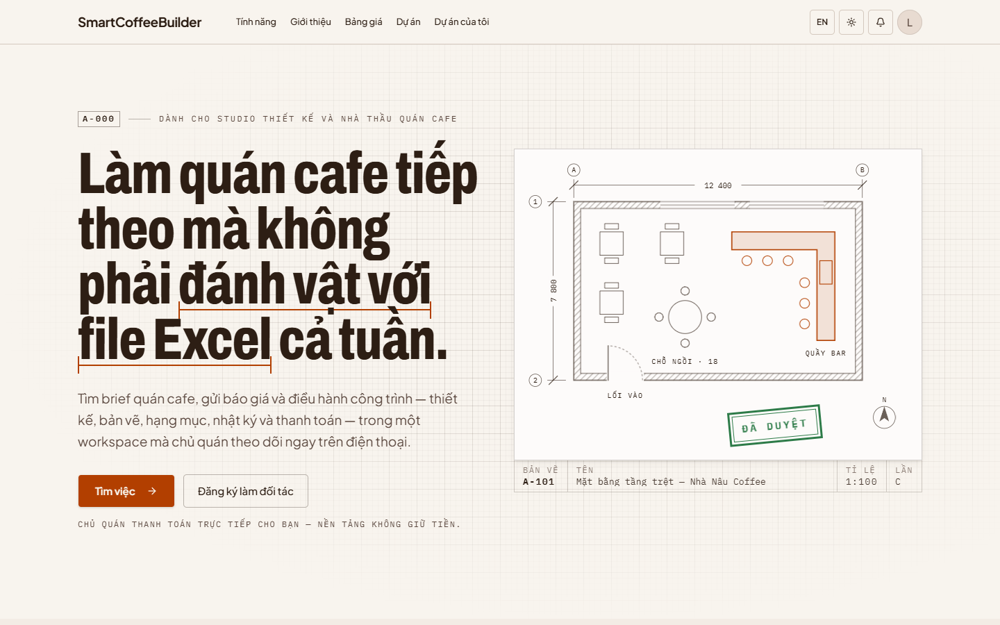

*Figure 1 — Home page*

### 1.3 Account menu

Select your avatar in the top-right corner to open the account menu. It shows the account you are signed in with and links to **“Vào workspace”** (Go to workspace), **“Dự án của tôi”** (My projects), **“Hồ sơ của tôi”** (My profile) and **“Đăng xuất”** (Sign out).

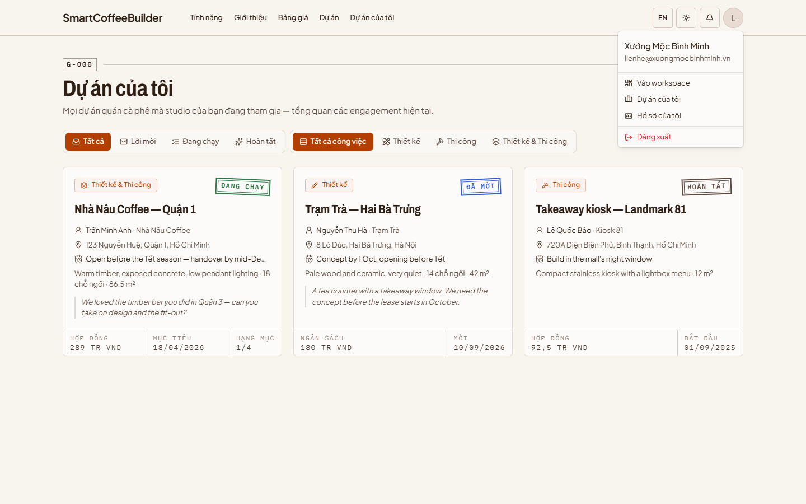

*Figure 2 — Account menu*

### 1.4 The project workspace

Opening a project takes you to its workspace:

- The **sidebar** on the left lists the project's tools, grouped by stage.
- The **breadcrumb** at the top shows where you are and links back to your projects.
- The top-right buttons are notifications, language and theme.
- Every page ends with a **title block** showing the project, its address, who is working on it, the sheet number of the page and the date it was last updated.

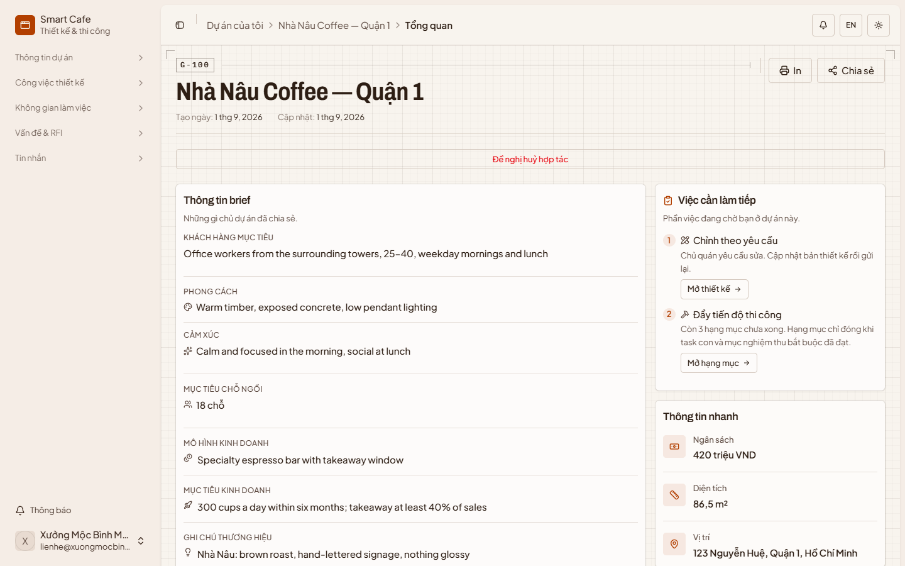

*Figure 3 — Project workspace*

The sidebar differs by role. Select a group heading to open or close it.

| Design & build | Designer | Contractor |
|---|---|---|
| 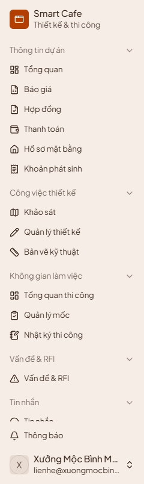 | 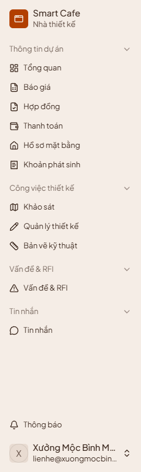 | 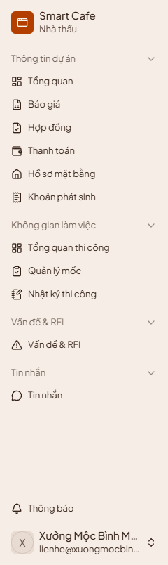 |

*Figures 4–6 — Sidebar for a design-and-build provider, a designer and a contractor*

- **“Thông tin dự án”** (Project info) — overview, quotations, contracts, payments, site profile and change orders. All roles.
- **“Công việc thiết kế”** (Design work) — survey, design management and technical drawings. Designers and design-and-build.
- **“Không gian làm việc”** (Workspace) — construction overview, milestones and daily log. Contractors and design-and-build.
- **“Vấn đề & RFI”** (Issues & RFI) and **“Tin nhắn”** (Messages) — all roles.

---

## 2. Account

### 2.1 Create an account

Step 1: Open the Registration page, either from **“Đăng ký làm đối tác”** (Join as a provider) on the home page or **“Đăng ký ngay”** (Register now) on the login page.

Step 2: Enter your full name, email, phone number and a password, then select **“Tạo tài khoản”** (Create account).

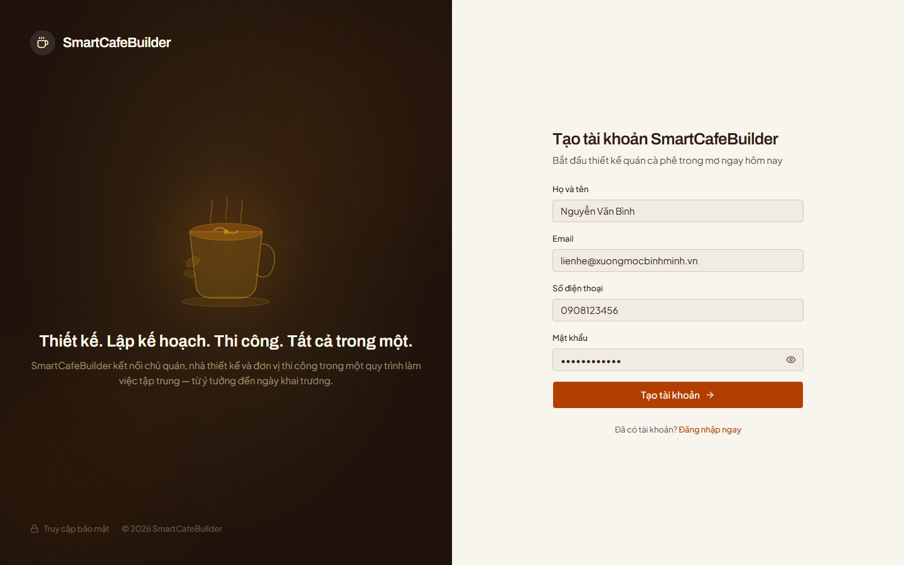

*Figure 7 — Registration*

### 2.2 Verify your email

After registering you are taken to onboarding, which has two steps: verify your email, then complete your profile.

Step 1: Select **“Gửi mã xác minh”** (Send verification code). A 6-digit code is sent to your email address.

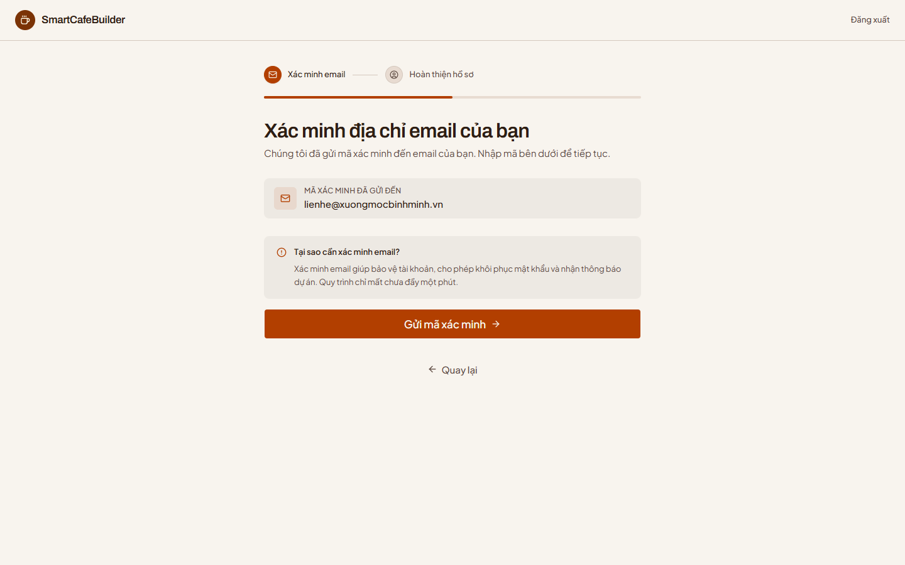

*Figure 8 — Send the verification code*

Step 2: Enter the code from the email into the six boxes and select **“Xác minh & Tiếp tục”** (Verify & continue). If the email has not arrived, check your spam folder or use the resend link once the countdown ends.

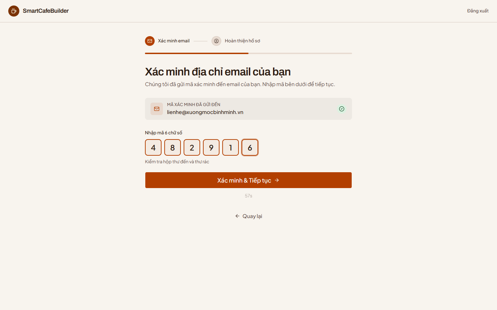

*Figure 9 — Enter the verification code*

### 2.3 Complete your provider profile

Fill in the profile owners will see:

- **“Tên hiển thị”** (Display name) — your studio or company name.
- **“Loại nhà cung cấp”** (Provider type) — **“Cá nhân”** (Individual) or **“Doanh nghiệp”** (Company).
- **“Năng lực”** (Capability) — **“Thiết kế”** (Design), **“Thi công”** (Construction) or **“Cả hai”** (Both). This decides which tools you get (see 1.1).
- **“Giới thiệu về bạn”** (About you), years of experience and a portfolio headline.
- **“Mã số thuế doanh nghiệp”** (Company tax code) — required for companies; used for verification.

Select the button at the bottom (for example **“Hoàn tất với tư cách Đơn vị thiết kế & thi công”** — Finish as a design & build studio) to create your profile.

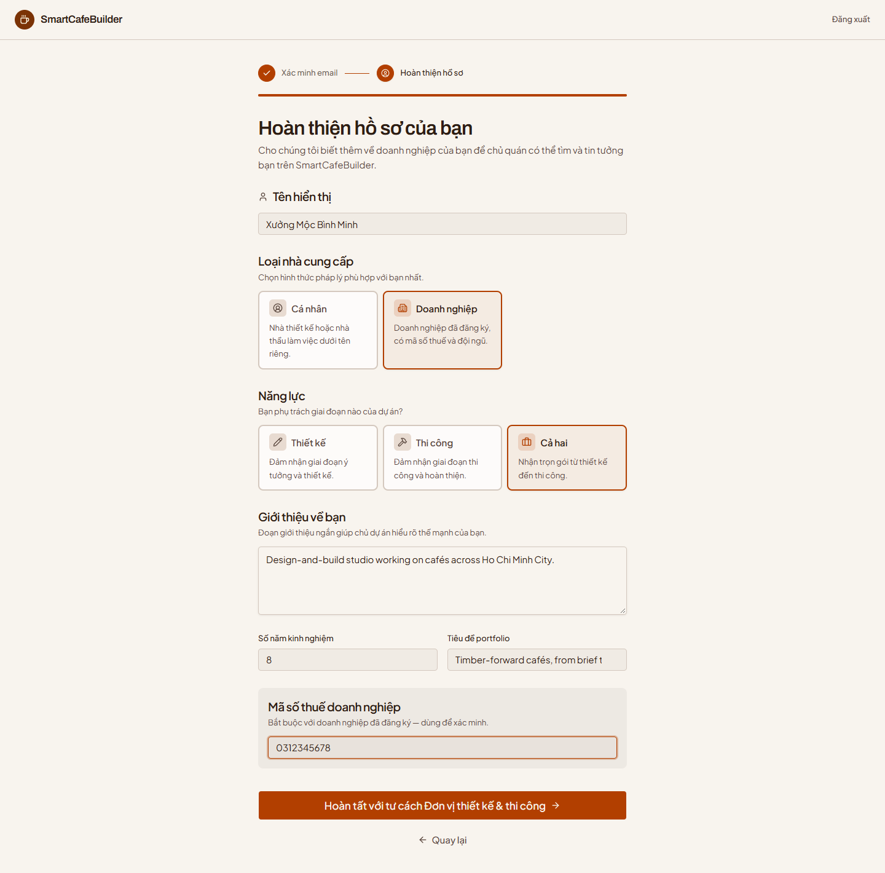

*Figure 10 — Complete your provider profile*

### 2.4 Log in

For all roles: open the Login page, enter your email and password, and select **“Đăng nhập”** (Log in). Tick **“Ghi nhớ đăng nhập”** (Remember me) to stay signed in on this device.

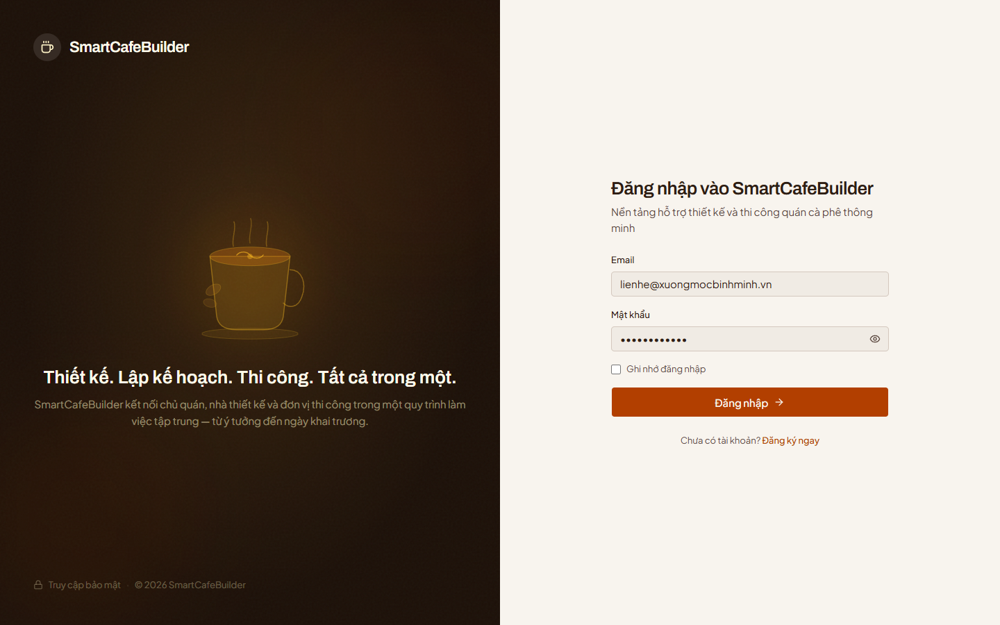

*Figure 11 — Login*

### 2.5 Sign out

Open the account menu (your avatar, top-right) and select **“Đăng xuất”** (Sign out).

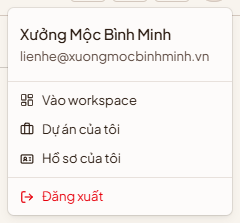

*Figure 12 — Sign out from the account menu*

---

## 3. Your provider profile

Your profile is what owners read when they decide whether to hire you. Open it from the account menu → **“Hồ sơ của tôi”** (My profile).

### 3.1 View your profile

The top of the page shows your logo, capability, name and verification stamp, with your portfolio count, rating, years of experience and join date in the strip underneath. Below are three tabs: **“Dự án mẫu”** (Portfolio), **“Thương hiệu”** (Brand) and **“Đánh giá”** (Reviews).

- Hover over the cover strip or the logo to upload or change the image.
- Select **“Xem hồ sơ công khai”** (View public profile) to see the page exactly as owners see it (3.6).

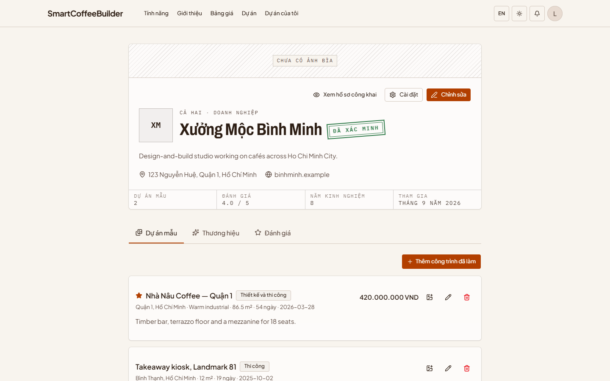

*Figure 13 — Your profile*

### 3.2 Edit your profile

Select **“Chỉnh sửa”** (Edit). Update your display name, provider type and capability, then select **“Lưu thay đổi”** (Save changes). Your account email is shown for reference; contact support to change it.

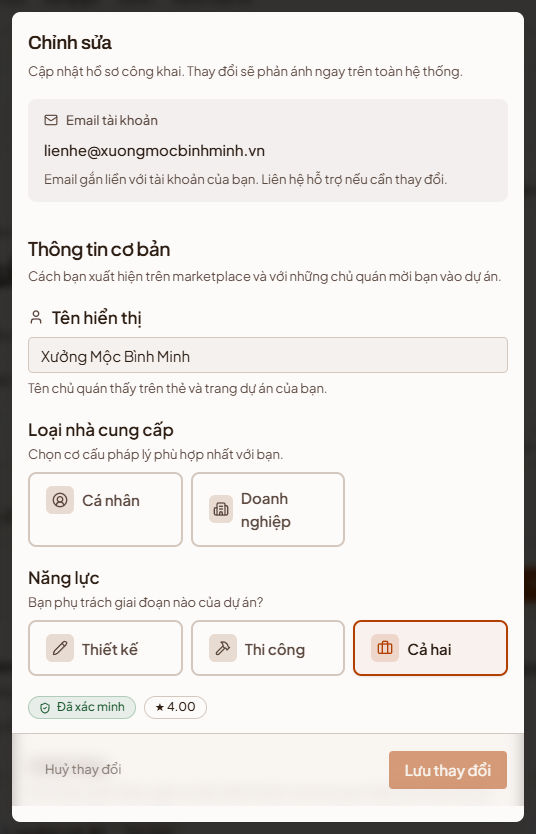

*Figure 14 — Edit profile*

### 3.3 Add past work

Past work shows owners what you have built before.

Step 1: On the **“Dự án mẫu”** (Portfolio) tab, select **“Thêm công trình đã làm”** (Add past work).

Step 2: Enter the project name, your part in it (design, construction or both), style, location, area, contract value, duration and completion date. Add photos or videos and a description, and tick **“Ghim lên đầu hồ sơ”** (Pin to top of profile) for your best work.

Step 3: Select **“Lưu”** (Save).

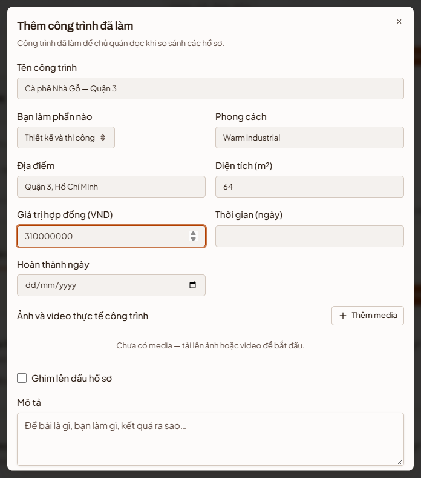

*Figure 15 — Add past work*

### 3.4 Brand

The **“Thương hiệu”** (Brand) tab holds the details owners check before hiring:

- **Brand summary** — founding year, team size, experience, rating and your brand story. Select **“Sửa thương hiệu”** (Edit brand) to change them.
- **“Kênh liên hệ”** (Contact channels) — add social links with **“Thêm liên kết”** (Add link).
- **“Khu vực nhận việc”** (Service areas) — provinces and districts you work in, added with **“Thêm khu vực”** (Add area).
- **“Giấy phép và chứng chỉ”** (Licences and certificates) — add them with **“Thêm chứng chỉ”** (Add certificate). Only an administrator can mark one as verified.

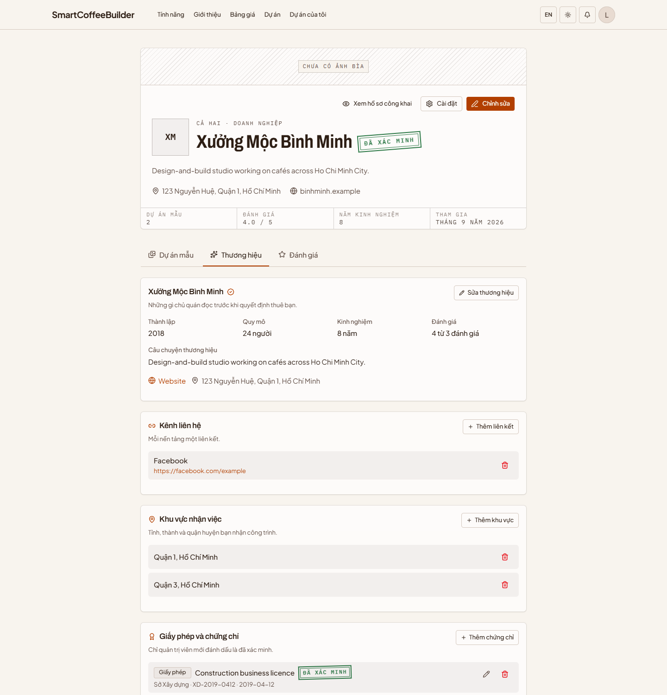

*Figure 16 — Brand tab*

### 3.5 Reviews

The **“Đánh giá”** (Reviews) tab shows the scores owners gave you after finished projects — overall, by criterion (progress, quality, communication, cost) and review by review, with your replies.

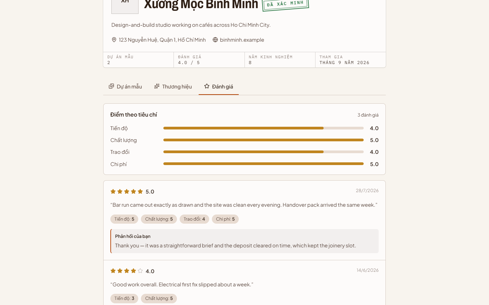

*Figure 17 — Reviews*

### 3.6 Public profile

Your public profile is the page owners open from the mobile app. It shows your cover, name, verification, particulars, and the About, Brand, Portfolio and Reviews tabs — without any editing controls.

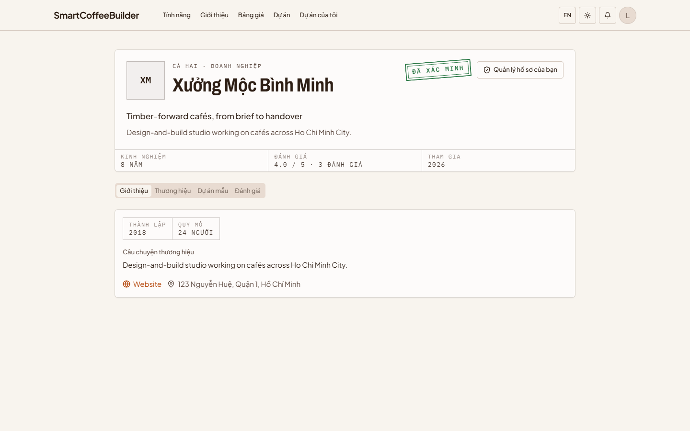

*Figure 18 — Public profile*

---

## 4. Finding work

Owners post briefs on the marketplace, or invite a provider directly.

### 4.1 Browse the marketplace

Open **“Dự án”** (Projects) in the top bar. Each card shows the service needed, the café, the brief, the address, the budget, the floor area and the deadline for bids. Use the search box and the filters for service, status and sort order to narrow the list.

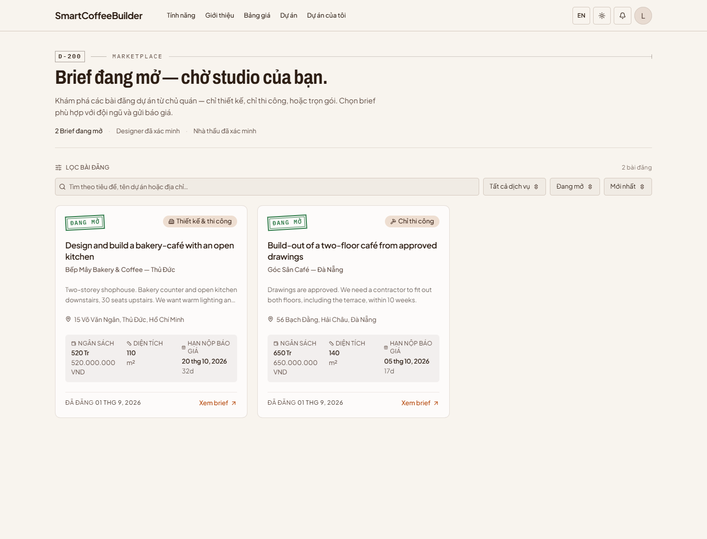

*Figure 19 — Marketplace*

### 4.2 Read a brief

Select **“Xem brief”** (View brief) on a card. The page shows everything the owner wrote — target customers, style, mood, seats, business model and goals, brand and operating notes, and their timeline — with the budget, area, location and the owner on the right.

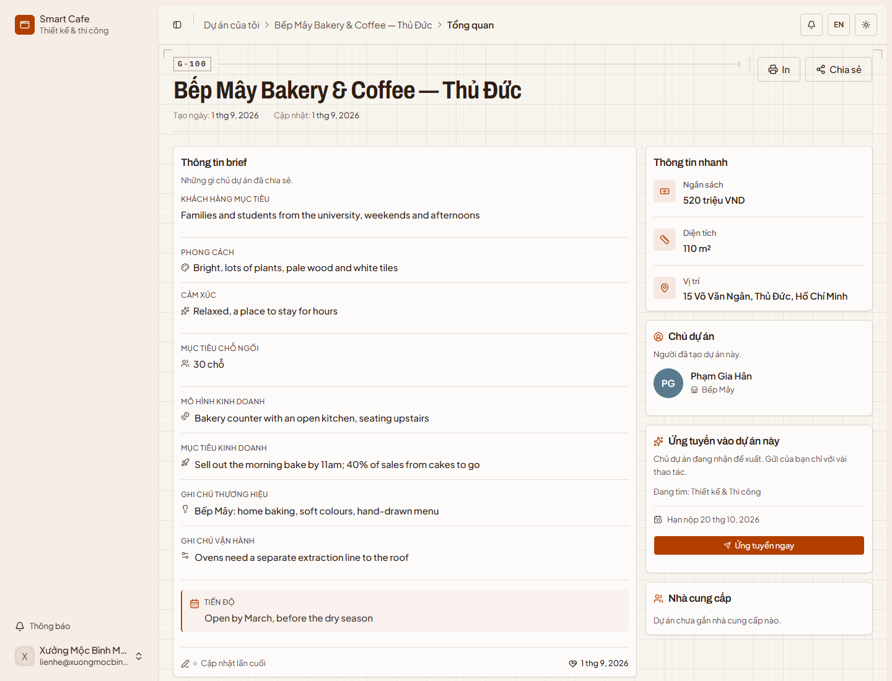

*Figure 20 — A brief*

### 4.3 Apply

Step 1: On the brief, select **“Ứng tuyển ngay”** (Apply now).

Step 2: In **“Đề xuất của bạn”** (Your proposal), explain your approach and relevant experience (at least 30 characters). Optionally enter the expected duration in days — you will confirm it in your quotation later.

Step 3: Select **“Gửi hồ sơ”** (Submit).

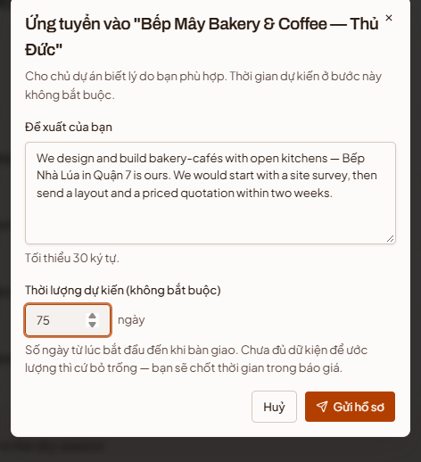

*Figure 21 — Apply to a brief*

### 4.4 Manage your bid

After applying, the card shows **“Đã gửi hồ sơ ứng tuyển”** (Application sent). From here you can:

- **“Gửi báo giá chi tiết”** (Send a detailed quotation) — see 5.3.
- **“Sửa hồ sơ”** (Edit application) or **“Rút hồ sơ”** (Withdraw application).
- For briefs that include design, record your site survey (see 6.1) — the owner can only choose you once the survey is done.

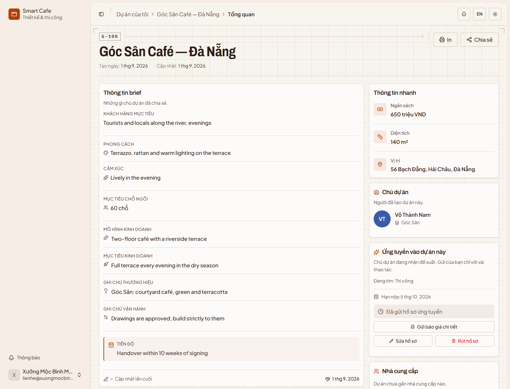

*Figure 22 — A submitted bid*

### 4.5 My projects

**“Dự án của tôi”** (My projects) lists every job you are part of. Each card shows the client, address, timeline, a one-line brief and the owner's message, with the contract value (or budget), target date and progress along the bottom. Filter by **“Lời mời”** (Invitations), **“Đang chạy”** (Active) or **“Hoàn tất”** (Completed), and by type of work. Select a card to open the project.

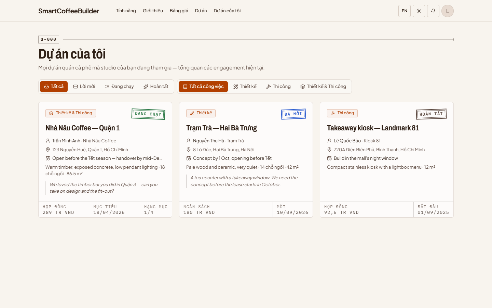

*Figure 23 — My projects*

### 4.6 Answer an invitation

When an owner invites you directly, the job appears under **“Lời mời”** (Invitations) with the same details, so you can decide without opening it. Select **“Chấp nhận”** (Accept) to join the project, or **“Từ chối”** (Decline).

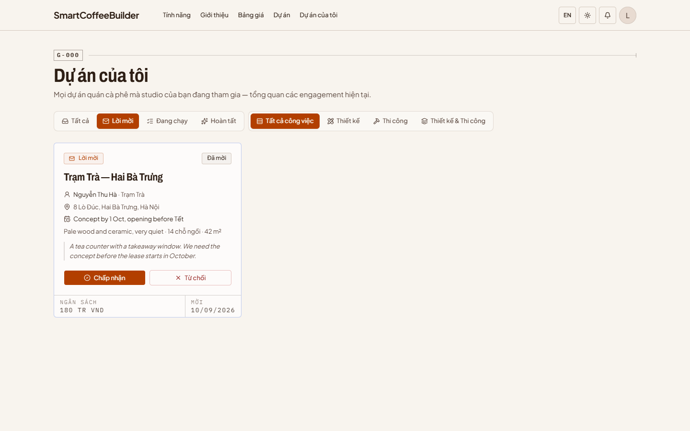

*Figure 24 — An invitation*

---

## 5. Working on a project

These tools are available to every provider on a project.

### 5.1 Project overview

The overview is the first page of a project. It shows the owner's brief on the left and, on the right:

- **“Việc cần làm tiếp”** (Next steps) — what the job needs from you now, with a button that opens the right page.
- **“Thông tin nhanh”** (Quick facts) — budget, area and location.
- **“Chủ dự án”** (Owner) — with **“Nhắn tin”** (Message), which opens the project's messages (5.7).
- **“Nhà cung cấp”** (Providers) — who else is working on the project.

**“In”** (Print) and **“Chia sẻ”** (Share, copies the link) are at the top.

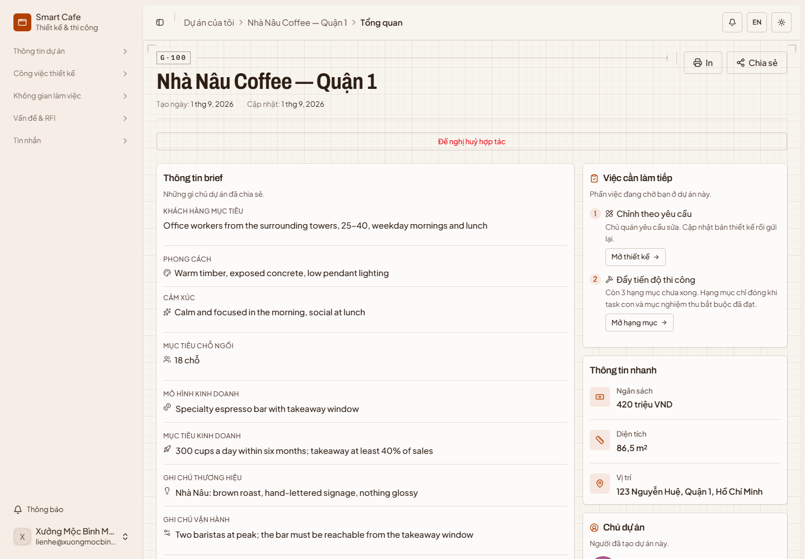

*Figure 25 — Project overview*

### 5.2 Site profile

**“Hồ sơ mặt bằng”** (Site profile) holds the real measurements of the premises: depth, width, frontage, ceiling height, orientation, floors and mezzanine, the structure and the condition it is handed over in, each floor's area and purpose, and every door, window and balcony. Select **“Sửa”** (Edit), **“Thêm tầng”** (Add floor) or **“Thêm ô cửa”** (Add opening) to update them.

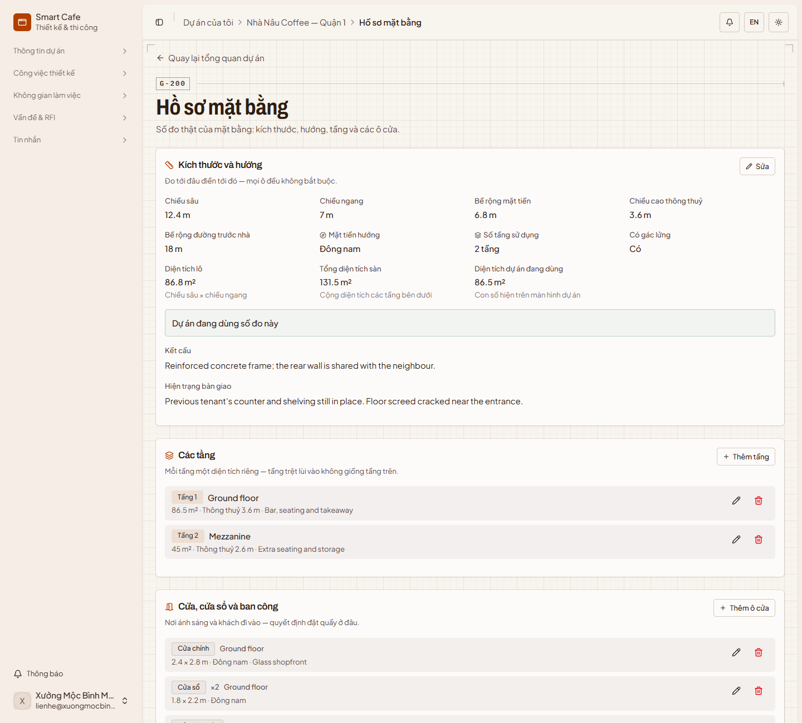

*Figure 26 — Site profile*

### 5.3 Quotations

**“Báo giá”** (Quotations) lists every version you have sent, with its status stamp, line items and payment schedule. The owner can approve a quotation, reject it or ask for another version.

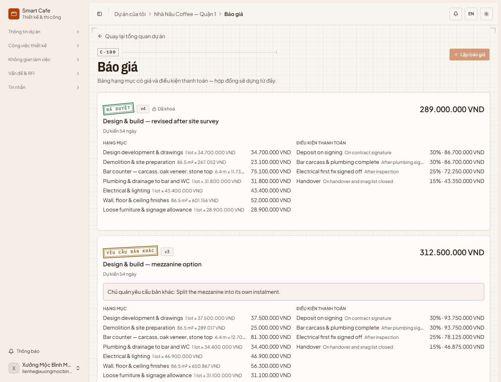

*Figure 27 — Quotations*

To create a quotation:

Step 1: Select **“Lập báo giá”** (Create quotation). This is only possible while no other quotation is open.

Step 2: Enter a title and the duration in days.

Step 3: Under **“Hạng mục”** (Items), add a line for each thing the owner pays for — name, unit, quantity and unit price — with **“Thêm dòng”** (Add line). The total is calculated for you.

Step 4: Under **“Điều kiện thanh toán”** (Payment terms), add the instalments with **“Thêm đợt”** (Add instalment). These become the project's payment batches once the contract is signed.

Step 5: Save the draft, then select **“Gửi chủ quán”** (Send to owner). If the owner asks for changes, select **“Phát hành bản mới”** (Issue a new version).

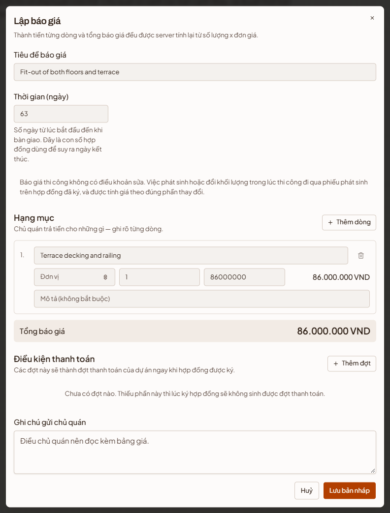

*Figure 28 — Create a quotation*

### 5.4 Contracts

**“Hợp đồng”** (Contracts) shows the project's contracts and their status: draft, **“Chờ xác nhận”** (Awaiting OTP confirmation), **“Đã xác nhận”** (Confirmed) or **“Đã hủy”** (Cancelled). A project can only have one active contract.

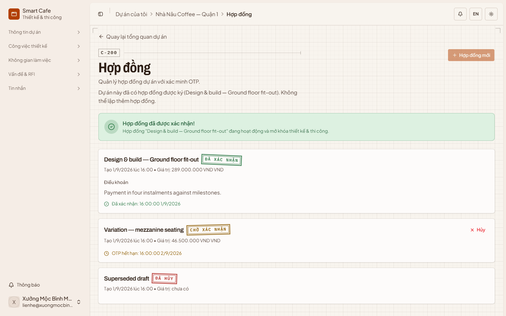

*Figure 29 — Contracts*

To create a contract once the owner has approved your quotation:

Step 1: Select **“Hợp đồng mới”** (New contract).

Step 2: Enter a title and choose the approved quotation under **“Dựng từ báo giá”** (Build from quotation). The agreed value and duration are taken from it. Add the start date, party details, terms and, optionally, the contract document.

Step 3: Select **“Tạo hợp đồng”** (Create contract). The contract is saved as a draft you can still edit.

Step 4: Select **“Gửi OTP”** (Send OTP). The contract is locked and the owner receives a one-time code, which they enter in the mobile app to sign. You can **“Hủy”** (Cancel) the contract while it is a draft or awaiting the code.

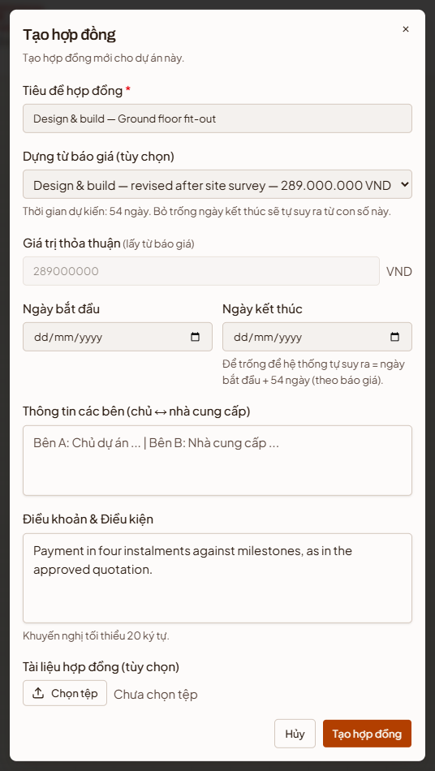

*Figure 30 — Create a contract*

### 5.5 Payments

The platform never holds money: the owner pays you directly and uploads proof, and you confirm it against your own bank account.

**“Thanh toán”** (Payments) shows the contract total as a bar split into confirmed, awaiting confirmation and not yet paid, and the payment schedule as a numbered list of instalments with their share, amount, due date and proof. Use the filters to show one status.

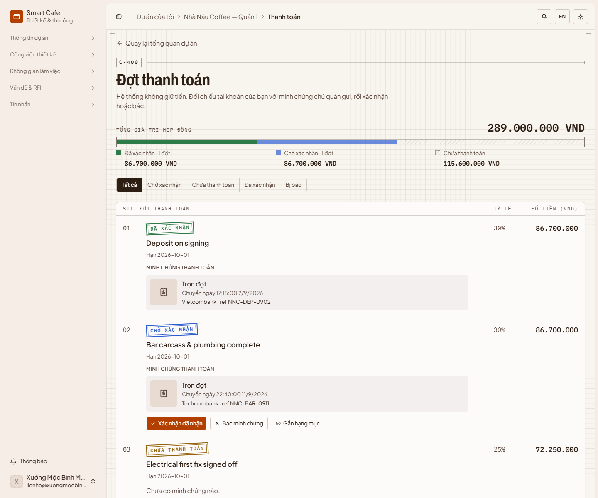

*Figure 31 — Payments*

When an instalment shows **“Chờ xác nhận”** (Awaiting confirmation):

- Check your bank account, then select **“Xác nhận đã nhận”** (Confirm receipt) and **“Xác nhận”** (Confirm). The instalment closes and its linked milestone is marked as paid. This cannot be undone.

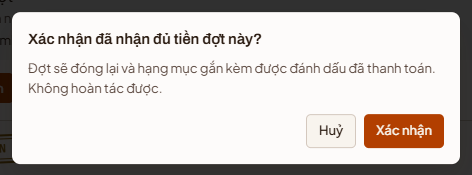

*Figure 32 — Confirm a payment*

- If the transfer is wrong or the receipt unreadable, select **“Bác minh chứng”** (Reject proof), explain what is wrong so the owner can fix it, and select **“Bác”** (Reject).

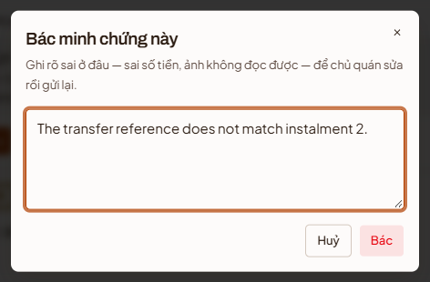

*Figure 33 — Reject a payment proof*

To tie an instalment to the milestone it pays for, select **“Gắn hạng mục”** (Link a milestone), choose the milestone and select **“Lưu”** (Save).

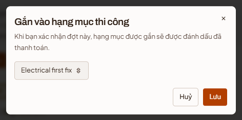

*Figure 34 — Link an instalment to a milestone*

### 5.6 Change orders

**“Khoản phát sinh”** (Change orders) records work added or changed after the contract was signed. The page shows the contract value, approved and pending change orders and the new total, followed by each change order with its status.

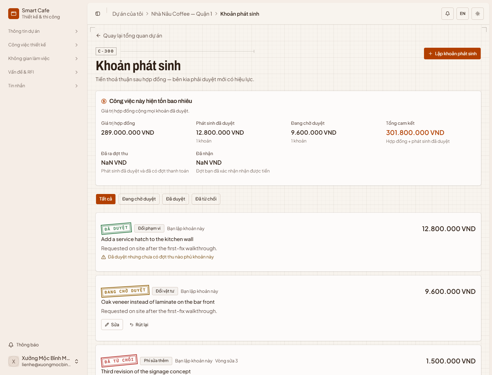

*Figure 35 — Change orders*

To raise a change order:

Step 1: Select **“Lập khoản phát sinh”** (Create change order).

Step 2: Choose the type, the milestone it belongs to, a title, the amount and the reason — the reason is what the owner reads before deciding.

Step 3: Select **“Gửi duyệt”** (Send for approval). When the owner approves it and pays, it becomes an extra instalment on the Payments page.

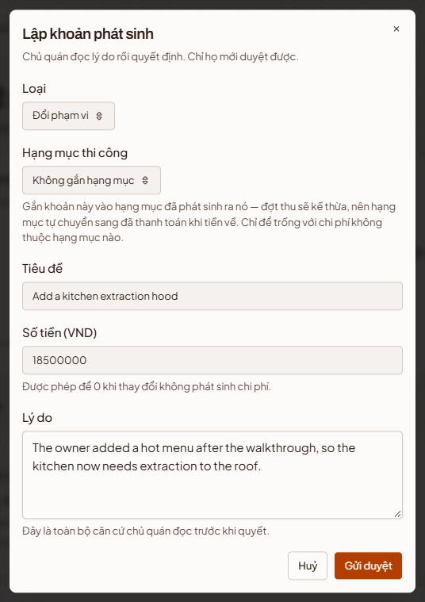

*Figure 36 — Create a change order*

### 5.7 Messages

**“Tin nhắn”** (Messages) holds the project's conversations with the owner. Threads are listed on the left (filter **“Tất cả”** — All, **“Trực tiếp”** — Direct, **“Phòng”** — Rooms); the open thread is in the middle; shared files and members are on the right. Type in the box at the bottom and press Enter or the send button. Use the paperclip to attach files.

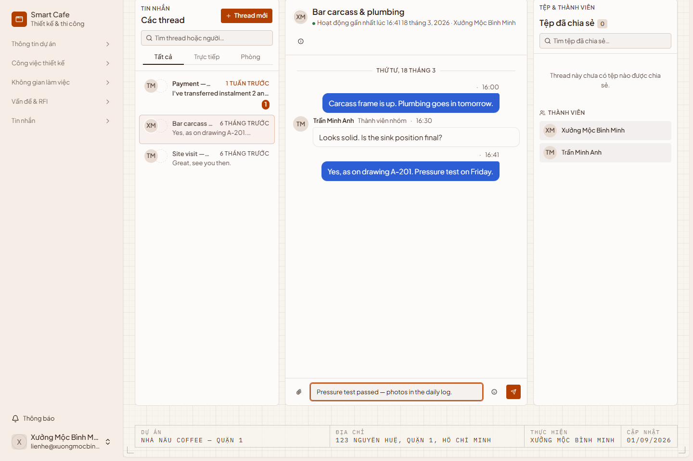

*Figure 37 — Messages*

To start a new conversation, select **“Thread mới”** (New thread), enter a topic and select **“Tạo Thread”** (Create thread).

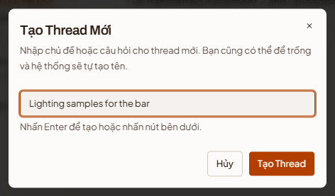

*Figure 38 — New thread*

### 5.8 Finishing or ending a job

- When every milestone is done, select **“Báo hoàn thành”** (Report completion) on the overview. The owner then checks the work and accepts it.
- To end a job early, select **“Đề nghị huỷ hợp tác”** (Propose ending the engagement), optionally give a reason, and select **“Gửi đề nghị”** (Send proposal). The engagement only ends if the owner agrees.

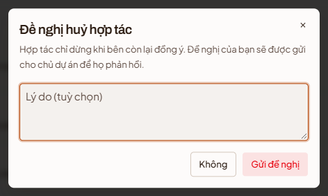

*Figure 39 — Propose ending the engagement*

---

## 6. Design work

*For designers and design-and-build providers.*

### 6.1 Site survey

**“Khảo sát”** (Survey) records the site conditions before design starts. The latest survey is shown first, with earlier ones below.

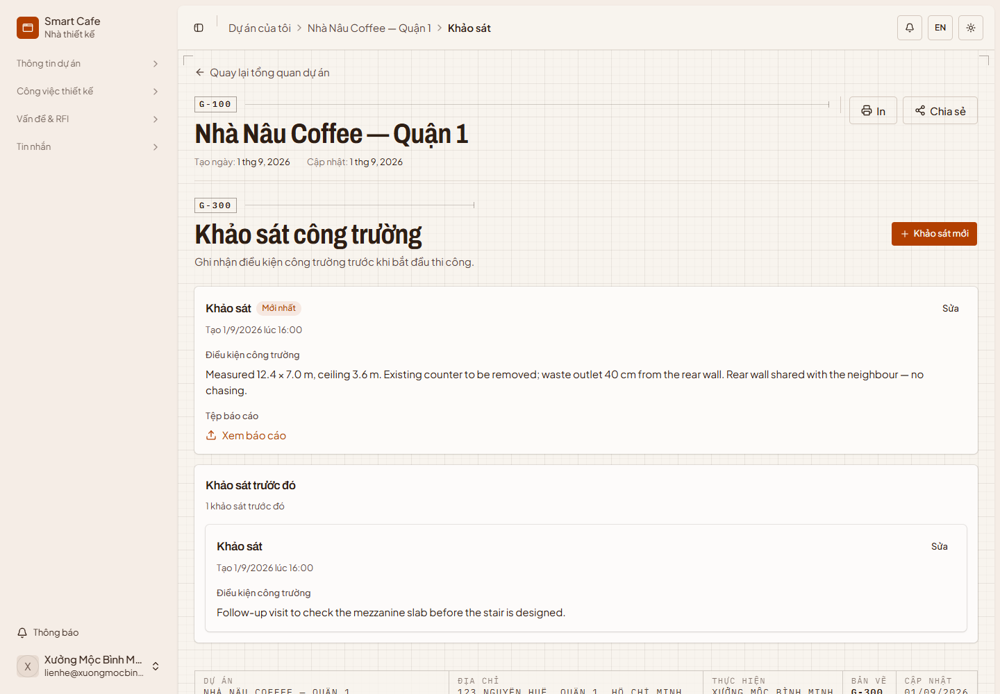

*Figure 40 — Site survey*

To record a survey:

Step 1: Select **“Khảo sát mới”** (New survey).

Step 2: Enter the date you visited, describe the site conditions (at least 10 characters) and attach the survey report as a PDF or image.

Step 3: Select **“Tạo khảo sát”** (Create survey). Select **“Sửa”** (Edit) on a survey to change it later.

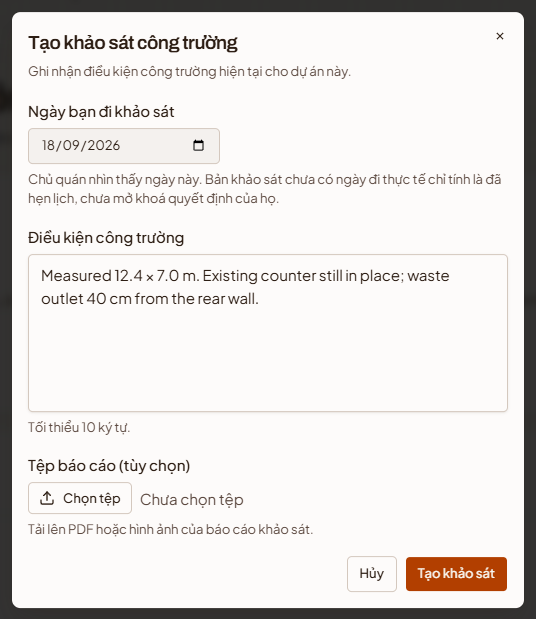

*Figure 41 — New survey*

### 6.2 Design management

**“Quản lý thiết kế”** (Design management) lists every design version with its status — **“Đang làm”** (In progress), **“Chờ duyệt”** (Submitted), **“Cần chỉnh sửa”** (Revision requested) or **“Đã duyệt”** (Approved) — its drawings, revision count and change summary. Filter by type with the tabs across the top. Select a version to read and post comments in the panel on the right.

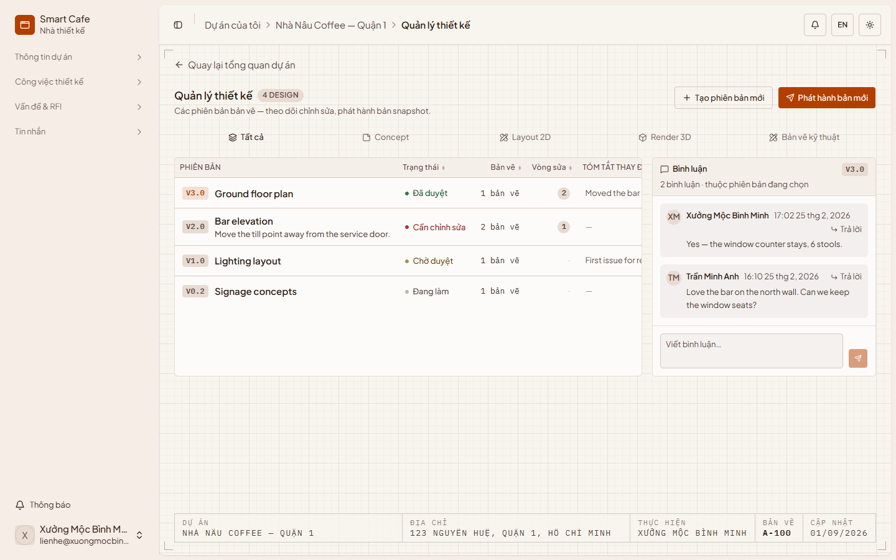

*Figure 42 — Design management*

To start a new version, select **“Tạo phiên bản mới”** (New version), enter its name, type and notes, and select **“Tạo phiên bản”** (Create version).

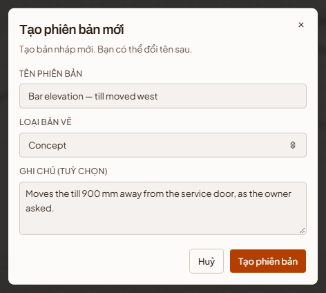

*Figure 43 — New design version*

### 6.3 Working on a design version

Open a version to work on it. Drawings are listed on the left, the selected drawing is shown in the middle, and the version's status, change summary, revision budget and approval history are on the right.

- **Upload drawings** — drag files onto **“Kéo thả hoặc nhấn để tải lên”** (Drag and drop or click to upload) and add a caption. Use **“Tải về”** (Download) and **“Trước”/“Sau”** (Previous/Next) in the viewer.
- **Revision requested** — the owner's reason is shown on the right. Select **“Bắt đầu chỉnh sửa”** (Start revision) to begin the next round. The revision budget shows how many free rounds the quotation includes and whether the next round will be charged.

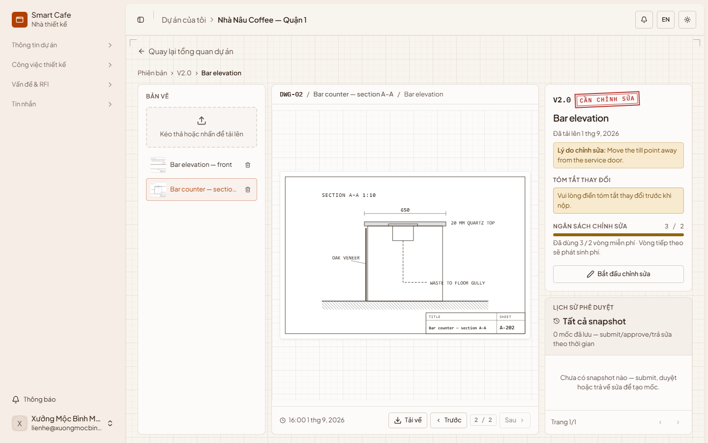

*Figure 44 — A design version with a revision requested*

- **Submit for approval** — when the drawings are ready, write the change summary with **“Sửa tóm tắt”** (Edit summary), then select **“Gửi phê duyệt”** (Submit for approval). The owner approves it or asks for changes from the mobile app.

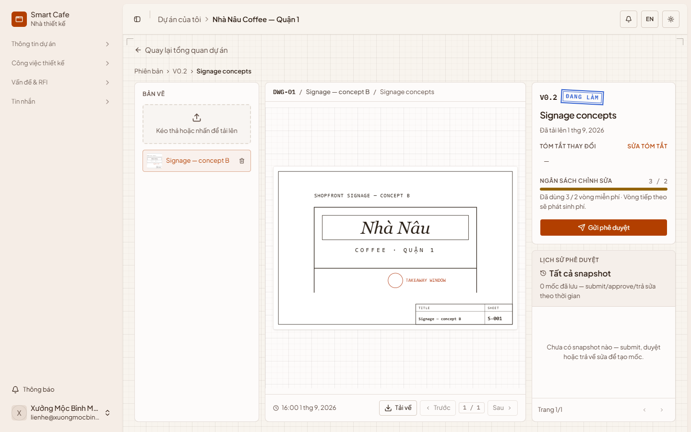

*Figure 45 — Submit a version for approval*

### 6.4 Technical drawings

**“Bản vẽ kỹ thuật”** (Technical drawings) is the read-only set of drawings the owner has approved — the ones construction is built from. Select **“Mở”** (Open) to view a drawing.

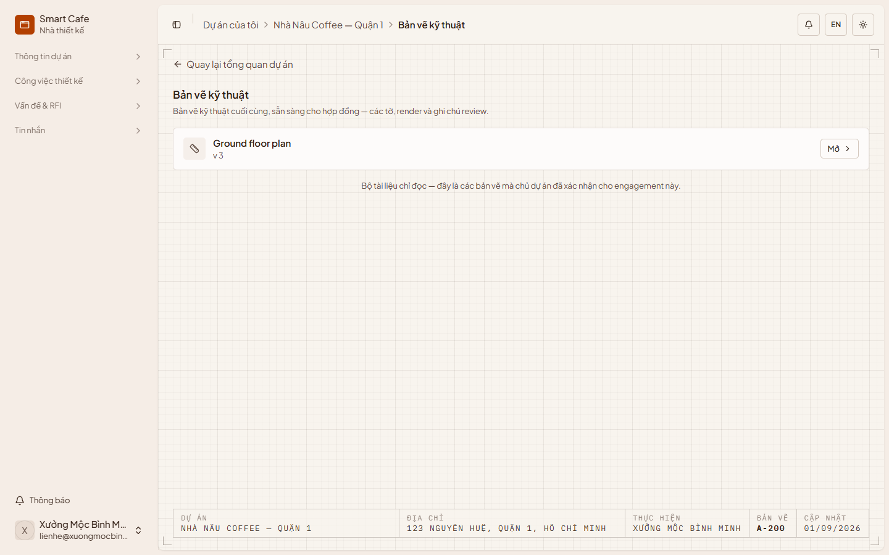

*Figure 46 — Technical drawings*

---

## 7. Construction work

*For contractors and design-and-build providers.*

### 7.1 Construction overview

**“Tổng quan thi công”** (Construction overview) shows the state of the site at a glance: the current phase, overall progress and last update, a track of milestones with their progress, the selected milestone's tasks and blockers, and the cost of the build — estimated against actual, including approved change orders.

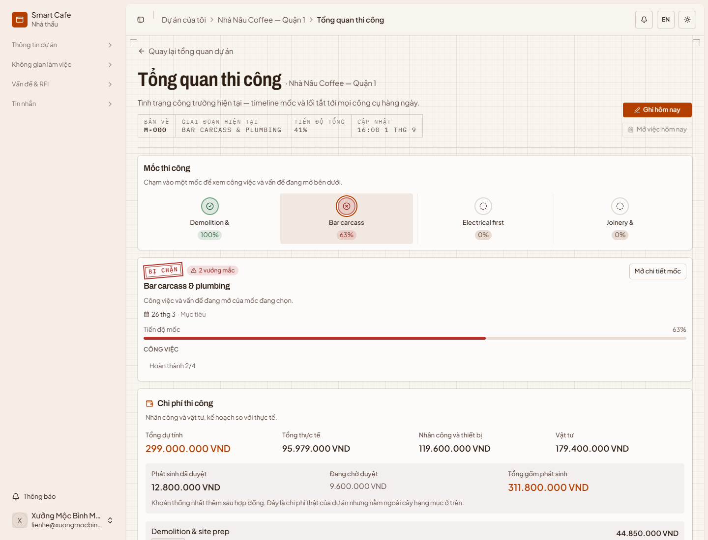

*Figure 47 — Construction overview*

Select **“Mở chi tiết mốc”** (Open milestone details) to see a milestone's progress, tasks and open issues in a side panel.

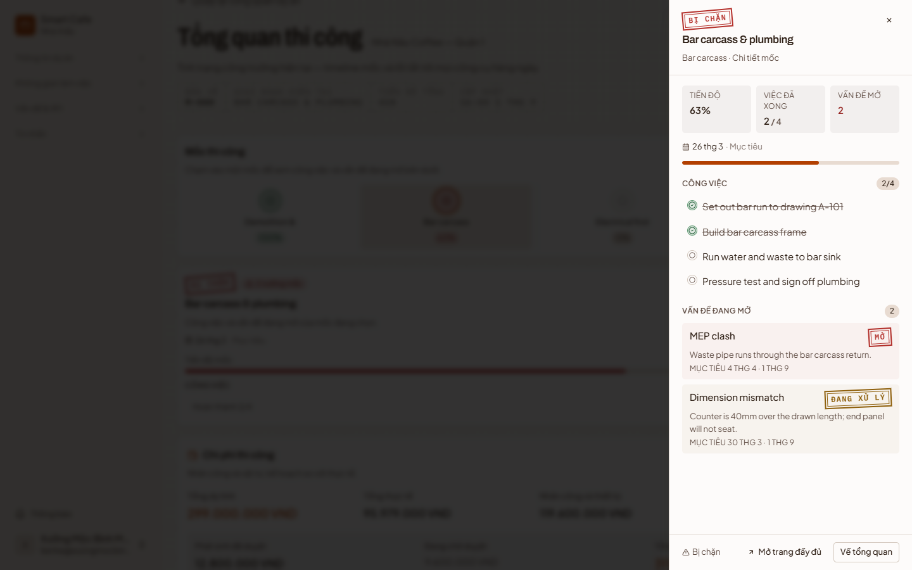

*Figure 48 — Milestone details*

### 7.2 Milestones and tasks

**“Quản lý mốc”** (Milestones) is the construction schedule. Each milestone shows its sheet number, tasks done, dates, status stamp and whether it has been paid, with its tasks underneath. Drag milestones to reorder them.

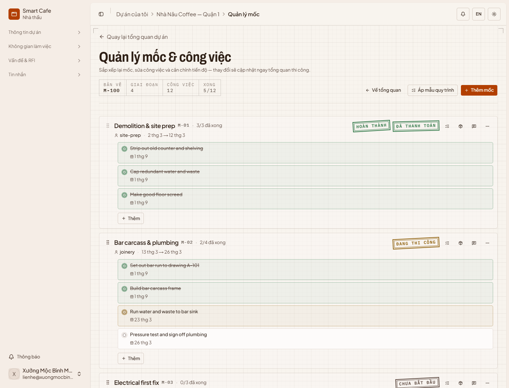

*Figure 49 — Milestones*

- **Add a milestone** — select **“Thêm mốc”** (Add milestone), enter its name, dates and details, and save. This requires a signed contract.

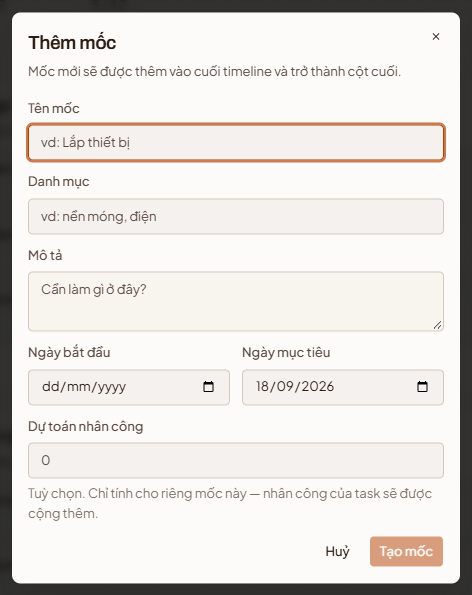

*Figure 50 — Add a milestone*

- **Apply a template** — select **“Áp mẫu quy trình”** (Apply process template), choose a template (select **“Xem các hạng mục”** — Show phases — to preview it), set the start date and select **“Áp vào dự án”** (Apply to project). The template's milestones and tasks are added next to any you already have.

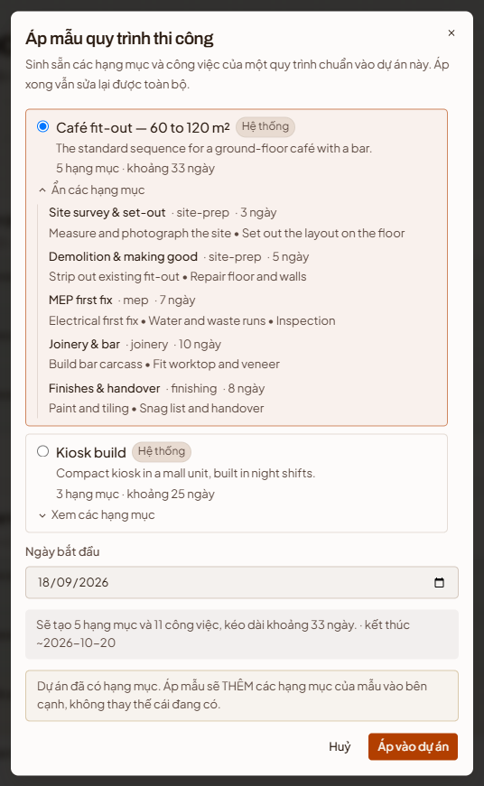

*Figure 51 — Apply a process template*

- **Add a task** — select **“Thêm”** (Add) under a milestone, enter the title, description, dates and labour estimate, optionally attach a reference image, and select **“Tạo công việc”** (Create task). Tick a task's circle to change its status.

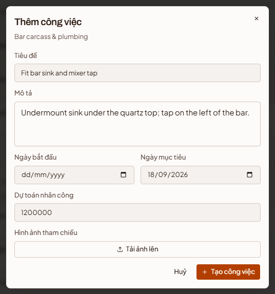

*Figure 52 — Add a task*

### 7.3 Sign-off checklist and materials

Each milestone has three buttons on its right: checklist, materials and the owner's notes.

**“Checklist nghiệm thu”** (Sign-off checklist) lists what the owner will check before accepting the milestone. Add items with **“Thêm mục”** (Add item) and mark whether each is required. A milestone cannot be closed until every required item has passed.

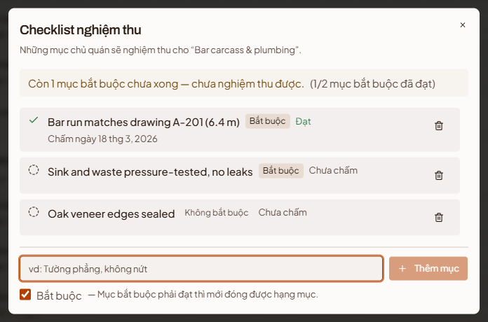

*Figure 53 — Sign-off checklist*

**“Vật tư”** (Materials) shows the milestone's materials and cost. Publish your prices in **“Bảng giá vật tư”** (Material price list), add materials to the milestone with an estimated quantity, and record the actual quantity once the work is done. The totals at the top compare estimated and actual cost.

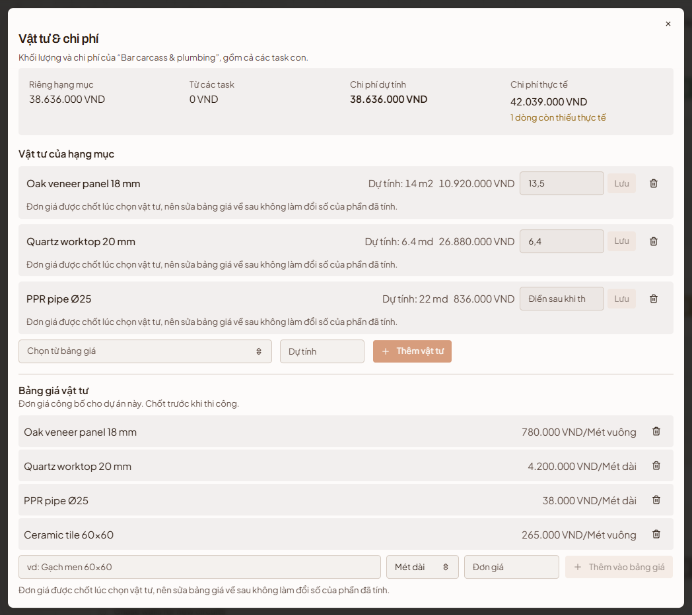

*Figure 54 — Materials and cost*

### 7.4 Daily log

**“Nhật ký thi công”** (Daily log) lets the owner follow progress without visiting the site. Each entry shows the date, milestone and task, who wrote it, the work done, any problems, the weather and the number of workers. Filter by milestone and date.

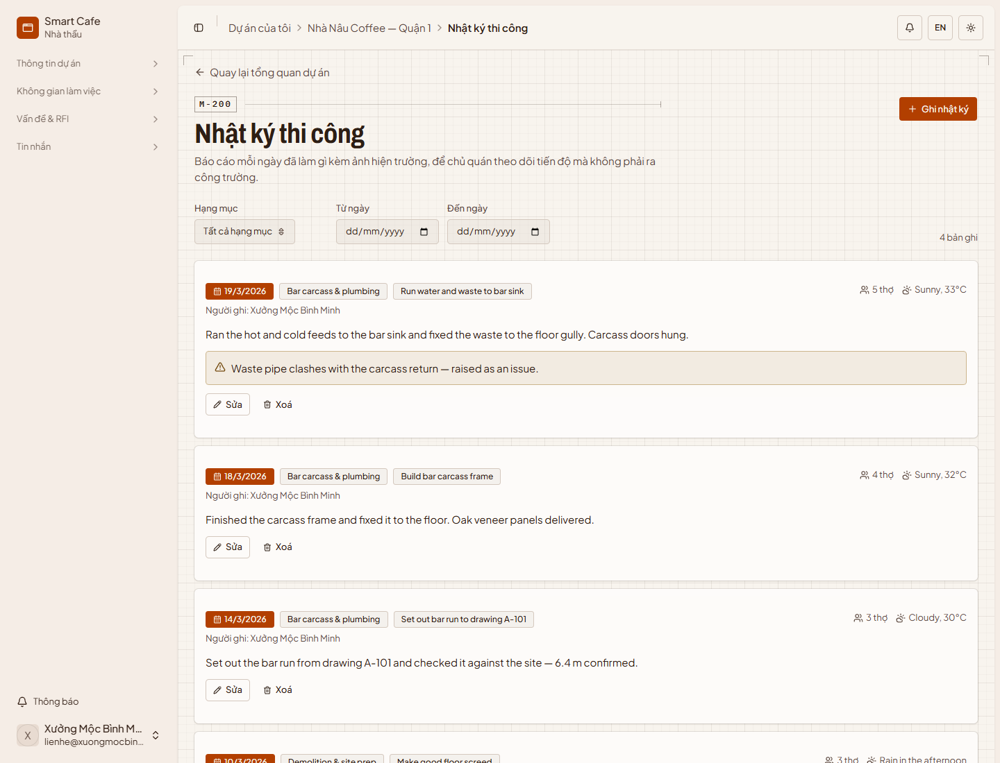

*Figure 55 — Daily log*

To write an entry:

Step 1: Select **“Ghi nhật ký”** (Write log entry).

Step 2: Choose the date and milestone, describe the work done and any problems, and enter the weather and number of workers on site.

Step 3: Add site photos or videos with **“Thêm file”** (Add file), then select **“Lưu nhật ký”** (Save entry).

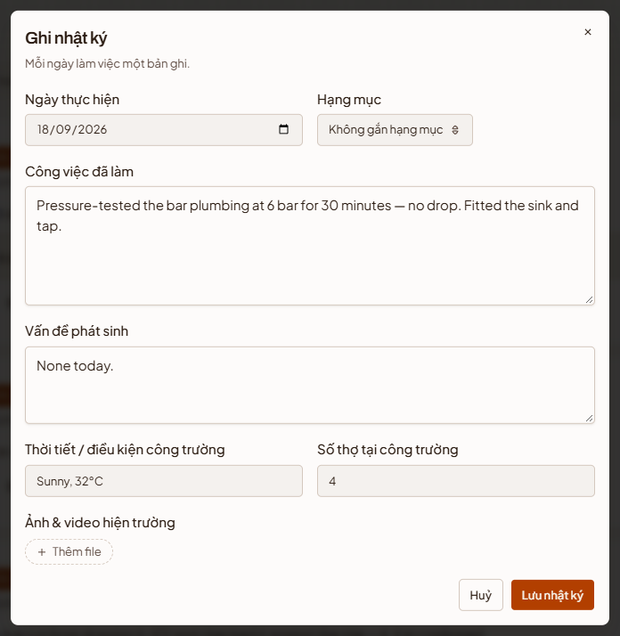

*Figure 56 — New daily log entry*

### 7.5 Issues and RFIs

**“Vấn đề & RFI”** (Issues & RFI) tracks problems found on site, grouped by status — **“Mới”** (New), **“Đang xử lý”** (In progress), **“Đã xử lý”** (Resolved) and **“Đã đóng”** (Closed). Select an issue to see its details on the right. Change its status with the arrow next to its status stamp, and select **“Sửa vấn đề”** (Edit issue) to update the details or add photos.

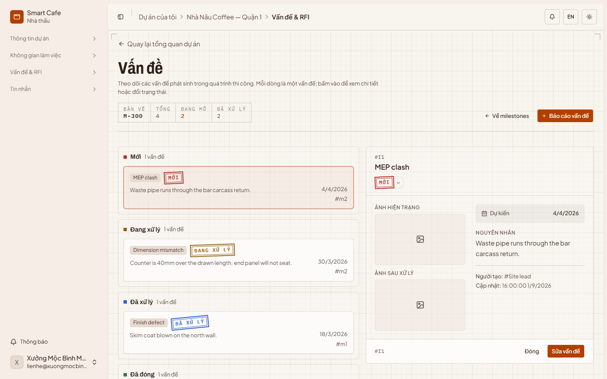

*Figure 57 — Issues*

To report an issue:

Step 1: Select **“Báo cáo vấn đề”** (Report issue).

Step 2: Choose the issue type, then describe the cause, the reason and the proposed solution. Set the expected fix date and attach a photo of the problem.

Step 3: Select **“Tạo vấn đề”** (Create issue). When it is fixed, open the issue, select **“Sửa vấn đề”** (Edit issue) and add a photo of the result under **“Ảnh sau xử lý”** (Photo after the fix).

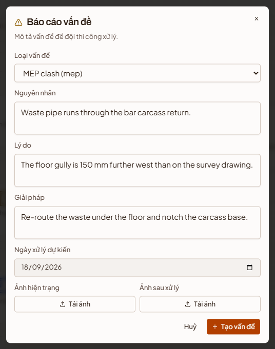

*Figure 58 — Report an issue*

---

## 8. Notifications

**“Thông báo”** (Notifications) collects everything that needs your attention: payment proofs, invitations, revision requests, accepted quotations, signed contracts and new issues. Unread notifications are marked with a red dot. Filter by **“Chưa đọc”** (Unread) or **“Đã đọc”** (Read), select a notification to open the page it refers to, and use the tick to mark it as read.

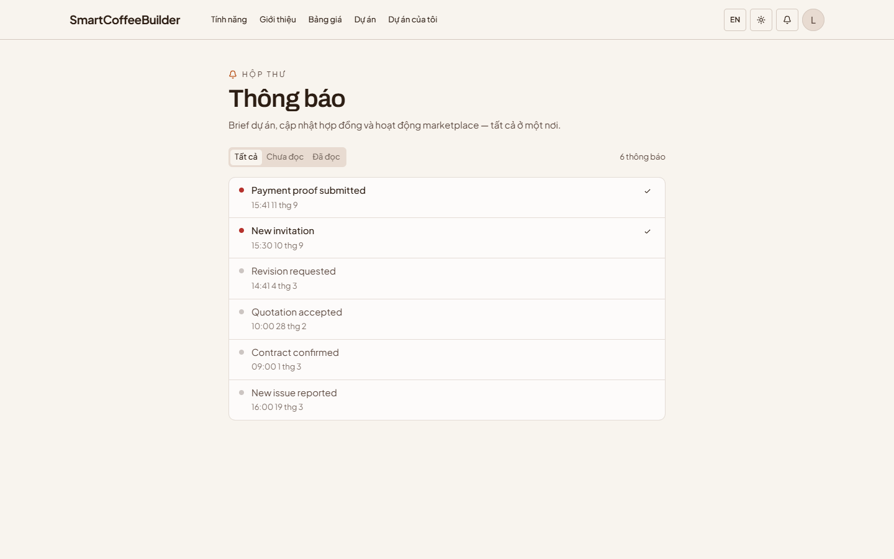

*Figure 59 — Notifications*

The bell in the top bar shows the latest notifications from any page. Select **“Đánh dấu đã đọc”** (Mark as read) to clear them, or **“Xem tất cả”** (See all) to open the Notifications page.

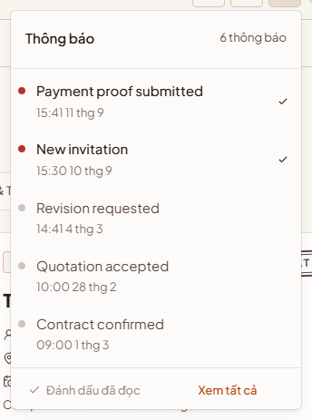

*Figure 60 — Notification bell*

---

## 9. Subscription

A subscription unlocks bidding on the marketplace and the other provider features for the period you choose.

Step 1: Open **“Bảng giá”** (Pricing) in the top bar, compare the plans and select **“Đăng ký”** (Subscribe) on the one you want.

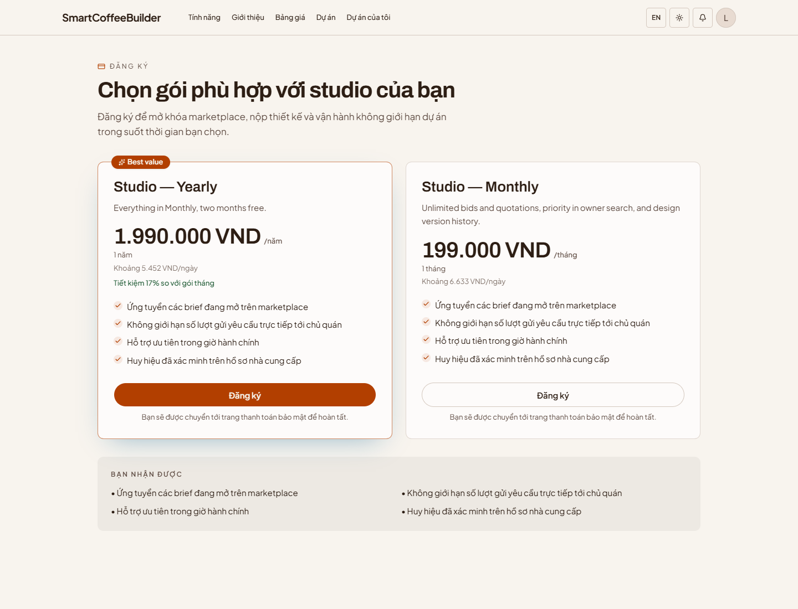

*Figure 61 — Pricing*

Step 2: Check the plan, its duration and the total, then select **“Tiếp tục thanh toán”** (Continue to payment). You are taken to payOS to pay; SmartCafeBuilder never sees your card or bank details.

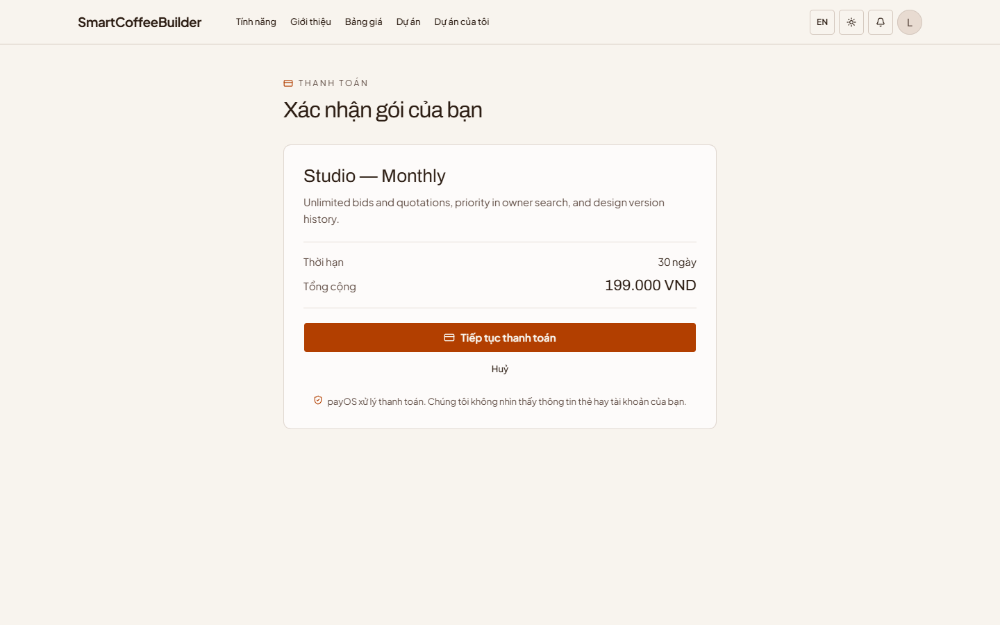

*Figure 62 — Confirm your plan*

Step 3: After paying you are returned to SmartCafeBuilder, which confirms the subscription is active. Select **“Xem marketplace”** (View marketplace) to start bidding.

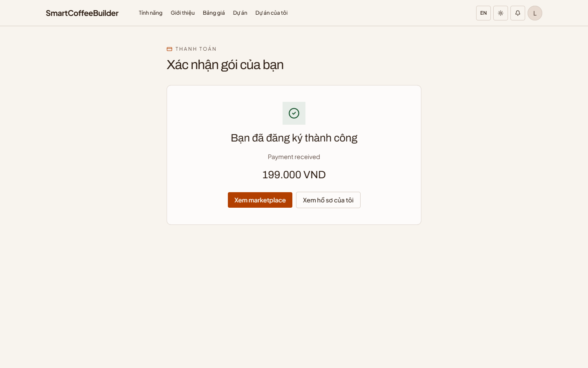

*Figure 63 — Subscription confirmed*
